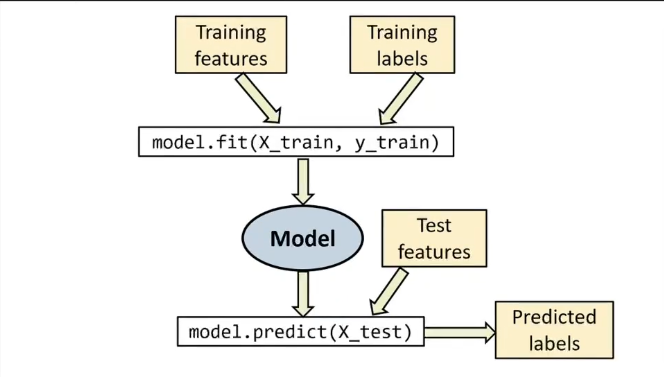
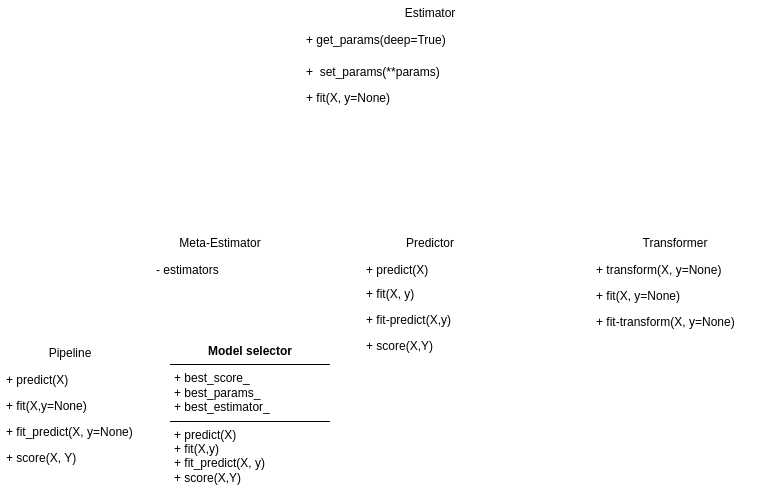

# Estimator API
the Estimator API is the cornerstone of scikit-learn's design philosophy, providing 
a consistent and intuitive interface for all machine learning algorithms implemented 
in the library. This uniformity is one of sckit-learn's greatest strenghths, allowing users
to easily switch between diffrent algorithms without having to learn entirely new syntax.
the Estimator API defines a common interface for all machine learning models in sckit-learn, 
simplifying the process of bulding, training and using these models.

An Estimator in sckit-learn is any object that learns from data. This includes:

+ Supervised learning algorithms(e.g., linear regression, random forests)
+ UnSupervised learning algorithms(e.g., k-means clustering, PCA)
+ Feature extraction methods(e.g., vectorizers)
+ Feature selection tools

Estimators are designed to be used as building blocks in more complex machine learning workflows,
often combined using tools like Pipeline.
All Estimators in sckit-learn adhere to a specific contract, which defines their 
behavior and ensures consistency across diffrent implementations. This contract includes:
1. Intialization with hyperparameters
2. Learning from data using the `fit()` method.
3. Making predictions or transforming data using method like `predict()`, `transforme()`, or `fit_transform()`.




Understanding the Estimator API is crucial for effectively using sckit-learn.
It allows you to:
1. Quickly adapt to new algorithms and tools within the library
2. Build Modular and reusable machine learning pipelines.
3. Leverage sckit-learns model selection and evaluation tools consistently across diffrent models.

the typical workflow when using an estimator follows these steps:
1. import the necessary Estimator class
2. Instantiate the Estimator with desired hyperparameters
3. Call the `fit()` method on your training data.
4. Use the fitted estimator to make predictions or transform new data


By mastering the Estimator API, you'll be well-equipped to tackle a wide range of machine learning
task using sckit-learn models to complex ensemble methods and preprocessing pipelines.


## 📑 Table of Contents

- [Core Components of the Estimator Interface](#Core-Components-of-the-Estimator-Interface)
    - [Hyperparameters](#Hyperparameters)
    - [Learned parameters](#Learned-parameters)
    - [Methods](#Methods)
    - [Attributes](#Attributes)
    - [Example:Putting it all together](#Example:Putting-it-all-together)
- [Architecture of Base Estimator and Derived Classes](#Architecture-of-Base-Estimator-and-Derived-Classes)
    - [Base Estimator:the Foundation](#Base-Estimator:the-Foundation)


## Core Components of the Estimator Interface
the Estimator Interface in sckit-learn is designed to provide a consistent and intuative way to 
interact with machine learning models. Underestanding its core components is essential for effectively 
using the library and buldings robust machine learning pipelines.


## Hyperparameters
Hyperparameters are the configurable aspects of an Estimator that are set before the learning 
process begins. They control behavior of the learning algorithm and can significantly impact 
model performance.
+ Hyperparameters are passed as arguments when instantiating an Estimator
+ They are typically stored as public attributes of the Estimator object.
+ Examples include ‍‍‍‍`n_neighbors` for KNN, `C` for SVM, or `max_depth` for decision trees.

```python
from sklearn.linear_model import LogisticRegression

# Instantiate with Hyperparameters
model = LogisticRegression(C=1.0, penalty='l1')

```

## Learned parameters
Learned parameters, also known as model parameters, are the values that the Estimator learns from the
data during the fitting process.

+ These parametes are typically denoted with a trailing underscore(e.g., `coef_`, `intercept_`).
+ They are only available after calling the `fit()` method.
+ Examples include the coefficients in linear regression or the split points in a decision tree.

```python
X, y = load_iris(as_frame=True, returnX_y=True)
model = LogisticRegression(max_iter=1000)
model.fit(X, y)
print(f"Coefficient: {model.coef_}")
```

## Methods
The Estimator Interface defines several key methods that are implemented by all estimators:
1. fit(X, y=None): This method trains the model using the provided data.
    + X: The input features
    + y: The target values(optional for unsupervised learning)
2. predict(X): For supervised learning, this method makes predictions for new data.
3. transform(X): For feature selection or dimensionality reduction, this method transforms the 
input data.
4. fit_transform(X, y=None): A convenience method that fits to the data, then transforms it.
5. score(X, y): Returns a default evaluation score for the model.

Pro Tip:Not all methods are applicable to every Estimator. For example, unsupervised learning
algorithms like PCA don't have a `predict()` method.    

## Attributes
Estimators have various attributes that provide information about the model:
+ Hyperparameter attributes: Set during initialization(e.g., knn.n_neighbors)
+ Learned parameter attributes: Available after fitting(e.g., linear_model.coef_)
+ Metadata attributes: Provide information about the model(e.g., feature_names_in_)

## Example:Putting it all together
Let's look at an exampple that demonstrates these components working together:
```python
from sklearn.ensemble import RandomForestClassifier
from sklearn.datasets import make_classification
from sklearn.model_selection import train_test_split

#create a dataset
X, y = make_classification(n_samples=1000, n_featurs = 20, n_classes=2, random_state=42)
X_train, X_test, y_train, y_test = train_test_split(X, y, test_size=0.2, random_state=42)

#instantiate with Hyperparameters
rf = RandomForestClassifier(n_estimators=100, max_depth=5, random_state=42)

#Fit the model
rf.fit(X_train, y_train)
```
```python
# Make predictions
y_pred = rf.predict(X_test)
```
```python
#score the model
score = rf.score(X_test, y_test)
print(f"model accuracy: {score:.2f}")
```
```python
# Access learned parameters
print(f"Number of featurs: {rf.n_featurs_in_}")
print(f"Feature importances: {rf.feature_importances_[:5]}")
```

## Architecture of Base Estimator and Derived Classes
Understanding the architecture behind sckit-learns estimators provides valuable 
insight into the library's design and helps explain the consistency and flexibility od its API.
At the core of this architecturs is the `BaseEstimator` class and a system of mixins that work 
together to create the diverse range of estimators available in sckit_learn.

The Architecture of sckit-learns estimators is built on a foundation of inheritance and composition,
allowing for code reuse, consistency and extensibility.
## Base Estimator:the Foundation
`BaseEstimator` is the base class for all estimators in sckit-learn. It provides common functionality 
that all estimatore share:
+ Automatic get/set of parameters
+ Cloning of estimators
+ Setting and getting feature names



```python
from sklearn.base import BaseEstimator

class MyCustoomEstimator(BaseEstimator):
    def __init__(self, param1=1, param2='value'):
        self.param1 = param1
        self.param2 = param2
    def fit(self, X, y):
    #implement fitting logic here
        return self

my_estimator = MyCustomEstimator(param1=2)
print(my_estimator.get_params()) #Automatically gets all parameters

```
> 💡 **Pro Tip:** When creating custom estimators, always inherit from `BaseEstimator` to ensure compatibility with scikit-learn's ecosystem.
