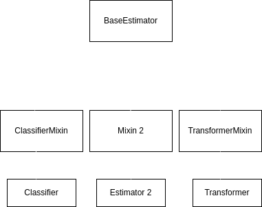

# Estimator API
the Estimator API is the cornerstone of scikit-learn's design philosophy, providing 
a consistent and intuitive interface for all machine learning algorithms implemented 
in the library. This uniformity is one of sckit-learn's greatest strenghths, allowing users
to easily switch between diffrent algorithms without having to learn entirely new syntax.
the Estimator API defines a common interface for all machine learning models in sckit-learn, 
simplifying the process of bulding, training and using these models.

An Estimator in sckit-learn is any object that learns from data. This includes:

+ Supervised learning algorithms(e.g., linear regression, random forests)
+ UnSupervised learning algorithms(e.g., k-means clustering, PCA)
+ Feature extraction methods(e.g., vectorizers)
+ Feature selection tools

Estimators are designed to be used as building blocks in more complex machine learning workflows,
often combined using tools like Pipeline.
All Estimators in sckit-learn adhere to a specific contract, which defines their 
behavior and ensures consistency across diffrent implementations. This contract includes:
1. Intialization with hyperparameters
2. Learning from data using the `fit()` method.
3. Making predictions or transforming data using method like `predict()`, `transforme()`, or `fit_transform()`.


Understanding the Estimator API is crucial for effectively using sckit-learn.
It allows you to:
1. Quickly adapt to new algorithms and tools within the library
2. Build Modular and reusable machine learning pipelines.
3. Leverage sckit-learns model selection and evaluation tools consistently across diffrent models.

the typical workflow when using an estimator follows these steps:
1. import the necessary Estimator class
2. Instantiate the Estimator with desired hyperparameters
3. Call the `fit()` method on your training data.
4. Use the fitted estimator to make predictions or transform new data


By mastering the Estimator API, you'll be well-equipped to tackle a wide range of machine learning
task using sckit-learn models to complex ensemble methods and preprocessing pipelines.


## 📑 Table of Contents

- [Core Components of the Estimator Interface](#Core-Components-of-the-Estimator-Interface)
    - [Hyperparameters](#Hyperparameters)
    - [Learned parameters](#Learned-parameters)
    - [Methods](#Methods)
    - [Attributes](#Attributes)
    - [Example: Putting it all together](#Example-Putting-it-all-together)
- [Architecture of Base Estimator and Derived Classes](#Architecture-of-Base-Estimator-and-Derived-Classes)
    - [Base Estimator: the Foundation](#Base-Estimator-the-Foundation)
    - [Mixin Classes: Adding Specific Behaviors](#Mixin-Classes-Adding-Specific-Behaviors)
    - [Implementing a Custom Estimator with Mixin](#Implementing-a-Custom-Estimator-with-Mixin)
    - [The Benifits of This Architecture](#The-Benifits-of-This-Architecture)
    - [Meta-Estimators and Composite Estimators](#Meta-Estimators-and-Composite-Estimators)


## Core Components of the Estimator Interface
the Estimator Interface in sckit-learn is designed to provide a consistent and intuative way to 
interact with machine learning models. Underestanding its core components is essential for effectively 
using the library and buldings robust machine learning pipelines.


## Hyperparameters
Hyperparameters are the configurable aspects of an Estimator that are set before the learning 
process begins. They control behavior of the learning algorithm and can significantly impact 
model performance.
+ Hyperparameters are passed as arguments when instantiating an Estimator
+ They are typically stored as public attributes of the Estimator object.
+ Examples include ‍‍‍‍`n_neighbors` for KNN, `C` for SVM, or `max_depth` for decision trees.

```python
from sklearn.linear_model import LogisticRegression

# Instantiate with Hyperparameters
model = LogisticRegression(C=1.0, penalty='l1')

```

## Learned parameters
Learned parameters, also known as model parameters, are the values that the Estimator learns from the
data during the fitting process.

+ These parametes are typically denoted with a trailing underscore(e.g., `coef_`, `intercept_`).
+ They are only available after calling the `fit()` method.
+ Examples include the coefficients in linear regression or the split points in a decision tree.

```python
X, y = load_iris(as_frame=True, returnX_y=True)
model = LogisticRegression(max_iter=1000)
model.fit(X, y)
print(f"Coefficient: {model.coef_}")
```

## Methods
The Estimator Interface defines several key methods that are implemented by all estimators:
1. fit(X, y=None): This method trains the model using the provided data.
    + X: The input features
    + y: The target values(optional for unsupervised learning)
2. predict(X): For supervised learning, this method makes predictions for new data.
3. transform(X): For feature selection or dimensionality reduction, this method transforms the 
input data.
4. fit_transform(X, y=None): A convenience method that fits to the data, then transforms it.
5. score(X, y): Returns a default evaluation score for the model.

Pro Tip:Not all methods are applicable to every Estimator. For example, unsupervised learning
algorithms like PCA don't have a `predict()` method.    

## Attributes
Estimators have various attributes that provide information about the model:
+ Hyperparameter attributes: Set during initialization(e.g., knn.n_neighbors)
+ Learned parameter attributes: Available after fitting(e.g., linear_model.coef_)
+ Metadata attributes: Provide information about the model(e.g., feature_names_in_)


## Example: Putting it all together
Let's look at an exampple that demonstrates these components working together:
```python
from sklearn.ensemble import RandomForestClassifier
from sklearn.datasets import make_classification
from sklearn.model_selection import train_test_split

#create a dataset
X, y = make_classification(n_samples=1000, n_featurs = 20, n_classes=2, random_state=42)
X_train, X_test, y_train, y_test = train_test_split(X, y, test_size=0.2, random_state=42)

#instantiate with Hyperparameters
rf = RandomForestClassifier(n_estimators=100, max_depth=5, random_state=42)

#Fit the model
rf.fit(X_train, y_train)
```
```python
# Make predictions
y_pred = rf.predict(X_test)
```
```python
#score the model
score = rf.score(X_test, y_test)
print(f"model accuracy: {score:.2f}")
```
```python
# Access learned parameters
print(f"Number of featurs: {rf.n_featurs_in_}")
print(f"Feature importances: {rf.feature_importances_[:5]}")
```

## Architecture of Base Estimator and Derived Classes
Understanding the architecture behind sckit-learns estimators provides valuable 
insight into the library's design and helps explain the consistency and flexibility od its API.
At the core of this architecturs is the `BaseEstimator` class and a system of mixins that work 
together to create the diverse range of estimators available in sckit_learn.

The Architecture of sckit-learns estimators is built on a foundation of inheritance and composition,
allowing for code reuse, consistency and extensibility.

## Base Estimator: the Foundation
`BaseEstimator` is the base class for all estimators in sckit-learn. It provides common functionality 
that all estimatore share:
+ Automatic get/set of parameters
+ Cloning of estimators
+ Setting and getting feature names


```python
from sklearn.base import BaseEstimator

class MyCustoomEstimator(BaseEstimator):
    def __init__(self, param1=1, param2='value'):
        self.param1 = param1
        self.param2 = param2
    def fit(self, X, y):
    #implement fitting logic here
        return self

my_estimator = MyCustomEstimator(param1=2)
print(my_estimator.get_params()) #Automatically gets all parameters

```
> 💡 **Pro Tip:** When creating custom estimators, always inherit from `BaseEstimator` to ensure compatibility with scikit-learn's ecosystem.

## Mixin Classes: Adding Specific Behaviors
Sckit-learn uses Mixin classes to add Specific behaviors to estimators.
common mixin include:
+ Classifier Mixin: for classification algorithms
+ RegressorMixin: for regression algorithms
+ TransformerMixin: for data transformation algorithms
+ ClusterMixin: for clustering algorithms

These mixins often provide default implementations of certain methods. for example,
`TransformerMixin` provides a default `fit_transform()` method.

```python
from sklearn.base import BaseEstimator, TransformerMixin

class MyCustomTransformer(BaseEstimator, TransformerMixin):
    def fit(self, X, y=None):
        return self
    
    def transform(self, X):
        # Implement transformation logic here
        return X
# now MyCustomTransformer has a fit_transform() method automatically

```
Here's an overview of BaseEstimator and key mixin classes, along with their primary
methods:

    BaseEstimator
    ├── get_params()
    ├── set_params()
    └── __repr__()
    |
    ├── ClassifierMixin
    ├── score()
    └── predict_proba() [optional]
    |
    ├── RegressorMixin
    └── score()
    |
    ├── TransformerMixin
    └── fit_transform()
    |
    ├── ClusterMixin
    ├── fit_predict()
    └── fit_transform()
    |
    ├── OutlierMixin
    └── fit_predict()

each mixin provides specific methods:

1. **ClassifierMixin**

    + score(X, y): Returns the mean accuracy on the given test data and labels.

    + predict_proba(X): (Optional) Returns probability estimates for samples.

2. **RegressorMixin**

    + score(X, y): Returns the coefficient of determination R² of the prediction.

3. **TransformerMixin**

    + fit_transform(X, y=None): Fits transformer to X and y, and returns transformed version of X.

4. **ClusterMixin**

    + fit_predict(X, y=None): Performs clustering on X and returns cluster labels.

    + fit_transform(X, y=None): Fits to X, transforms X, and returns transformed X.

5. **OutlierMixin**

    + fit_predict(X, y=None): Performs outlier detection on X and returns labels.



This diagram illustrates how concrete estimator classes (e.g., Classifier, Transformer) inherit from both BaseEstimator and specific mixin classes.

## Implementing a Custom Estimator with Mixin
Let's Create a Custom Classifier that utilizes both `BaseEstimator` and `ClassifierMixin` :

```python
from sklearn.base import BaseEstimator, ClassifierMixin
from sklearn.utils.validation import check_X_y, check_array, check_is_fitted
from sklearn.utils.multiclass import unique_labels
import numpy as np


class SimpleThresholdClassifier(BaseEstimator, ClassifierMixin):
    def __init__(self, threshold=0.5):
        self.threshold = threshold
    
    def fit(self, X, y):
        # check that x and y have correct shape
        X, y = check_X_y(X, y)
        # store the classes seen during fit
        self.classes_ = unique_labels(y)

        # store the first featur's threshold for each class
        self.threshold = {}
        for c in self.classes_:
        self.thresholds_[c] = np.mean(X[y == c, 0])

        #return the classifier
        return self
    
    def predict(self, X):
        #Check if fit has been called
        check_is_fitted(self)

        #input validation
        X = check_array(X)

        #predict class based on wether X's first features exceeds the threshold
        return np.array([self.classes_[1] if x[0] > self.threshold else self.classes_[0] for x in X])
```
```python
#Usage
clf = SimpleThresholdClassifier(threshold=0.6)
x = np.array([[0.1], [0.5], [0.7], [0.9]])
y = np.array([0, 0, 1, 1])
clf.fit(X,y)
```
```python
clf.predict([[0.55], [0.85]])
```

```python
clf.score(X, y)
```
In this example, `SimpleThresholdClassifier` inherits from both `BaseEstimator` and
`ClassifierMixin`. It gets the basic estimator functionality from `BaseEstimator` and the `score()`
method from `ClassifierMixin`.

>  **Key Concept:** By Combining `BaseEstimator` with appropriate mixins, you can 
create custom estimators that seamleesly integrate with sckit-learn's ecosystem.

> 💡 **Pro Tip:** When creating custom estimators, always consider which mixins are
appropriate for your use case. This ensures your estimator has all the expected
methods and behaviors.

By understanding the relationships between `BaseEstimator`, mixins, and concrete estimator classes,
you gain insight into sckit-learn's flexible and extensible design. This knowledge 
is invaluable when working with complex models, creating custom estimators, or contributing to the sckit-learn project itself.
## The Benifits of This Architecture
1. Code Reuse: Common functionalities are implemented once in `Base Estimator` 
or mixins and reused across all estimators.
2. Consistency: All estimators share a common interface, making it easier for users
to work with different algorithms.
3. Extensibility: New estimators can be easily created by combining `Base Estimator` 
with appropriate mixins.
4. Interoperability: This architecture ensures that custom estimators can work seamlessly 
with sckit-learn's model selection and evaluation tools.

## Meta Estimators and Composite Estimators
Sckit-learn also includes meta-estimators (like Pipeline and GridSearchCV) and composite 
estimators (like ensemble methods). These leverage the consistent interface provided
by `Base Estimator` to combine or enhance other estimators.
```python
from sklearn.pipeline import Pipeline
from sklearn.preprocessing import StandardScaler
from sklearn.svm import SVC

#Creating a pipeline of estimators
pipe = Pipeline([
    ('scaler', StandardScaler()),
    ('svm', SVC())
])

#The Pipeline itself is an estimator
isinstance(pipe, BaseEstimator)
```
**Why This Matters:** Understanding this architecture helps you:
1. Create custom estimators that integrate seamlessly with sckit-learn
2. Better understand how to use and combine existing estimators 
3. Appreciate the design decisions that make scikit-learn powerful and flexible

**Important Note:** While understanding this architecture is valuable, most of your work
with sckit-learn will involve using existing estimators rather than creating new ones.
However, this knowledge is crucial for advanced usage, debugging, and potentially 
contributing to the library.

By Understanding the architecture of `Base Estimator` and its derived classes,
you gain deeper insight into how sckit-learn achives its powerful and flexible
machine learning capabilities. This knowledge will serve you well as you work with more
complex models and potentially develop your own estimators.

## Commom Methods in Estimators
The Estimator API in sckit-learn provides a set of common methods that are consistently 
implemented across different types of estimators.
These methods from the backbone of how we interact with machine learning models in sckit-learn,
allowing for unified workflow regardless of the specific algorithm being used.


Mastering these common methods will enable you to work efficiently with any estimator in 
sckit-learn, streamlining your machine learning workflow.
### The fit() Method
The fit() Method is the cornerstone of all estimators. It's used to train the model on your data.
estimator.fit(X, y)
- X: The input featurs (typically a 2D array-like object)
- y: The target value (1D array-like for supervised learning, optional for unsupervised learning)

**Why This Matters:** The fit() is where the magic happens. It's here that your model learns the patterns in your data, adjusting its internal parameters to best represent these patterns.

Example using a Decision Tree Classifier:
```python 
from sklearn.tree import DecisionTreeClassifier
from sklearn.datasets import load_iris

# load the iris dataset
iris = load_iris()
X, y = iris.data, iris.target

# Create and train the model
dt_classifier = DecisionTreeClassifier(max_depth=3)
dt_classifier.fit(X, y)
``` 
```python 
print(f"Model trained on {dt_classifier.n_featurs_in_} features")
```

